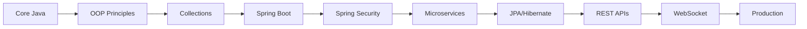
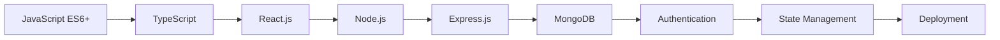
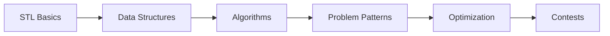

<div align="center">
  
# 👨‍💻 Khojiakbar Saidrasulov

[](https://git.io/typing-svg)


</div>

---

## 🚀 Tech Stack

<div align="center">

### 💻 Languages


### 🎯 Backend


### ⚛️ Frontend


### 🗄️ Database


### 🛠️ Tools & Technologies


</div>

---

## 📊 GitHub Stats

<div align="center">
  


</div>

---

## 💼 About Me

```typescript
const khojiakbar = {
    location: "Tashkent, Uzbekistan",
    education: "TATU - Cybersecurity Faculty",
    role: "Full Stack Developer",
    experience: "1+ years",
    
    code: ["Java", "JavaScript", "TypeScript", "C++"],
    
    technologies: {
        backend: {
            java: ["Spring Boot", "Spring Security", "JPA/Hibernate"],
            javascript: ["Node.js", "Express.js", "WebSocket"]
        },
        frontend: {
            frameworks: ["React.js"],
            styling: ["CSS3", "Tailwind CSS", "Responsive Design"],
            tools: ["Webpack", "Vite"]
        },
        databases: ["PostgreSQL", "MySQL", "MongoDB"],
        devOps: ["Git", "Docker", "Maven", "Gradle"],
        authentication: ["JWT", "OAuth2"]
    },
    
    competitiveProgramming: {
        platforms: ["ACMP.ru", "CSES", "HackerRank", "LeetCode"],
        problemsSolved: "500+",
        primaryLanguage: "C++",
        topics: ["Algorithms", "Data Structures", "Dynamic Programming"]
    },
    
    currentlyLearning: "Microservices Architecture & Cloud Computing",
    funFact: "I solve algorithms for breakfast! 🧮"
};
```

---

## 🎯 Development Roadmap

<details>
<summary><b>☕ Java Full Stack Journey</b></summary>
<br>



**Progress:**
- ✅ Core Java & OOP
- ✅ Collections Framework
- ✅ Spring Boot
- ✅ Spring Security
- 🔄 Microservices (In Progress)
- ⏳ Advanced Topics

</details>

<details>
<summary><b>⚡ JavaScript/TypeScript Stack Journey</b></summary>
<br>



**Progress:**
- ✅ JavaScript ES6+
- ✅ TypeScript
- ✅ React.js
- ✅ Node.js & Express
- 🔄 Advanced Patterns (In Progress)
- ⏳ Cloud Deployment

</details>

<details>
<summary><b>🏆 C++ Competitive Programming Journey</b></summary>
<br>



**Achievements:**
- ✅ 500+ Problems Solved
- ✅ STL Mastery
- ✅ Core Algorithms
- 🔄 Advanced Topics (In Progress)

</details>

---

## 🚀 Featured Projects

<div align="center">

| Project | Description | Tech Stack |
|---------|-------------|------------|
| **📝 Blog Platform** | Full-featured blogging system with authentication & real-time updates |      |
| **💬 Real-Time Chat** | Scalable chat app with private & group messaging |     |
| **✅ Task Manager** | Todo app with user management & JWT auth |     |
| **🔐 Auth Service** | Authentication microservice with role-based access |    |

</div>

---

## 🏅 Competitive Programming

<div align="center">

### 📈 Problem Solving Stats

| Platform | Problems Solved | Focus Areas |
|----------|----------------|-------------|
| **ACMP.ru** | 300+ | Main Practice Platform |
| **CSES** | 150+ | Algorithm Mastery |
| **HackerRank** | 50+ | Data Structures |
| **LeetCode** | Various | Interview Prep |

### 🎯 Algorithm Topics


</div>

---

## 🎨 Professional Interests

<div align="center">


</div>

---

## 🌐 Languages

| Language | Proficiency |
|----------|------------|
| 🇺🇿 Uzbek | Native |
| 🇬🇧 English | Intermediate |
| 🇷🇺 Russian | Learning |

---

## 📫 Connect With Me

<div align="center">

[](mailto:saidrasulovhojiakbar7@gmail.com)
[](https://github.com/Hojiakbar1101)
[](https://linkedin.com)
[](https://t.me/yourusername)

</div>

---

<div align="center">

### 💭 Quote
*"Building robust solutions through clean code and continuous learning"*

### 🐍 Contribution Graph


---

**⭐ From [Hojiakbar1101](https://github.com/Hojiakbar1101)**

</div>
